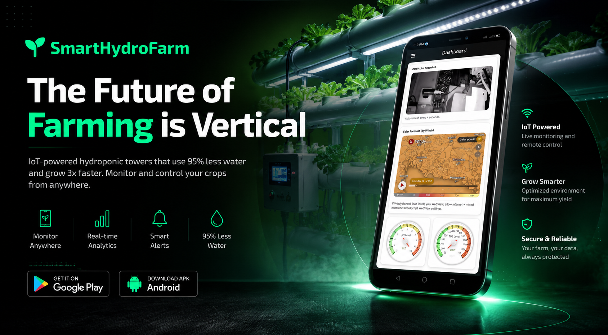

# SmartHydroFarm 🌱
<p align="center">
  
</p>
<p align="center">
  <b>Solar-Powered Automated System with Remote Monitoring and Control for Smart Hydroponic Vertical Farming</b>
</p>

<p align="center">
  An IoT-based smart farming solution developed as a capstone research project for the completion of the Bachelor of Science in Information Technology program.
</p>

---

## 📌 Overview

**SmartHydroFarm** is an IoT-enabled automated hydroponic farming system designed to improve crop management through real-time monitoring, automated nutrient control, and remote farm supervision.

The system integrates environmental sensors, microcontrollers, automation hardware, and a web-based monitoring platform to maintain optimal growing conditions by monitoring important parameters such as **pH level, Total Dissolved Solids (TDS), water temperature, air temperature, and humidity**.

Developed as a capstone research project, SmartHydroFarm aims to provide a sustainable and efficient approach to urban farming by reducing manual monitoring and improving resource management through automation.

---

## 🚀 Features

### 🌱 Smart Hydroponic Automation
- Automated nutrient dosing system
- Automatic pH adjustment using pH Up and pH Down solutions
- Automated water circulation and mixing
- Grow light control automation
- Real-time crop environment monitoring

### 📡 IoT Remote Monitoring
- Live farm status monitoring through a web dashboard
- Remote monitoring of sensor readings
- Wireless communication between farming hardware and server
- Periodic sensor data transmission

### ☀️ Solar-Powered System
- Renewable energy-powered operation
- Battery-supported continuous operation
- Designed for sustainable agricultural applications

### 📊 Monitoring Dashboard
- Real-time visualization of:
  - pH level
  - TDS / Nutrient concentration
  - Water temperature
  - Air temperature
  - Humidity
  - System status

---

## 🏗️ System Architecture

```text
┌───────────────┐
│    Sensors    │
└───────┬───────┘
        │
        ↓
┌───────────────┐
│ Arduino Nano  │
└───────┬───────┘
        │
        ↓
┌───────────────┐
│   ESP32-S3    │
│  Controller   │
└───────┬───────┘
        │
        ↓
┌──────────────────┐
│ HTTP Communication│
└────────┬─────────┘
         │
         ↓
┌──────────────────┐
│ Web Server &     │
│ Database         │
└────────┬─────────┘
         │
         ↓
┌──────────────────┐
│ SmartHydroFarm   │
│ Dashboard        │
└──────────────────┘

---

## 🛠️ Hardware Components

| Component | Purpose |
|------------|---------|
| ESP32-S3 | Main IoT controller and communication module |
| Arduino Nano | Sensor data acquisition |
| pH Sensor | Monitors acidity/alkalinity level |
| TDS Sensor | Measures nutrient concentration |
| DS18B20 Sensor | Water temperature monitoring |
| DHT11 Sensor | Air temperature and humidity monitoring |
| Peristaltic Pumps | Automated nutrient and pH solution dosing |
| Water Pump | Hydroponic water circulation |
| Grow Light | Controlled artificial lighting |
| Solar Panel System | Renewable power source |

---

## 💻 Software Technologies

### Embedded System
- Arduino IDE
- C/C++
- ESP32 Framework

### Web Platform
- HTML
- CSS
- JavaScript
- PHP
- MySQL

### Communication
- HTTP API
- REST-based data exchange

---

## 🌐 System Workflow

1. Sensors collect real-time hydroponic environment data.
2. Arduino Nano processes sensor readings.
3. ESP32-S3 receives and transmits data to the server.
4. The web platform stores and displays farm information.
5. Automated controls adjust nutrient levels and environmental conditions when needed.

---


